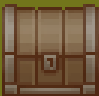
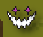

# 大作业文档

[toc]

## 游戏概览

这是一个可爱的指挥猫猫~~打架~~玩耍的小游戏。

游戏截图：

开始界面：

游戏教程：

HUD指示：

移动指示：

更多内容可在游戏中体验。

## 各个模块间逻辑关系

### 总览

其中，下层模块想上层模块提供服务。每个模块简要含义：

* `QGraphicsView`：这个是Qt自带的类，仅仅用来显示
* `Model`：对游戏内容建模，实现游戏逻辑、负责播放音效
* `Item`：其下类都继承自`QGraohicsItem`，提供可重用的图像绘制服务
* `UI`：其下类都继承自`QWidget`，实现带游戏素材背景的Panel对象
* `Util`：一些工具类
* `R`：管理全局资源

### 主要关系图

#### Util模块

##### QPixmapProvider

由于很多图片素材是多张图片拼接而成的，这个类的目的就是把一张大图片根据不同的方式进行切分，然后提供出去。这个类的子类有：

* QPixmapGirdSplitter：固定的通过网格切割，但有些素材的拼接时没有严格按照网格拼接。
* ~~QPixmapAutoSplitter~~：已弃用。自动根据像素间相近程度进行素材切割，但对粒子特效之类的素材效果极差，所以弃用。
* ~~QPixmapFileSeq~~：已弃用。有些动画素材是连续编号的文件组成的，这个类自动读取这一系列图片。但我没用这样的素材，于是弃用。

##### AsepriteObject

有一些动画素材是用`Aseprite`这个软件做的，这个软件可以导出一张大图和一个描述`json`，用来指明动画的每一帧是大图中的哪个区域，这个类能读取这两个文件，提供每一帧的图片、持续时间，动画方向等信息。

#### Item模块

这个模块的所有对象继承自`QGrphicsItem`，部分继承了`QObject`以启用动画。

这个模块是对基本图片资源的使用，支持动画，实现了`Model`所需要的函数，向`Model`模块提供服务。但是改模块并不关心各个图片在游戏中应该出现的展示大小和坐标位置，使用图片素材本身的大小和屏幕坐标。

详细介绍如下：

##### GameCharItem

这个类是一个接口类，要求实现游戏角色所需的各种动画，包含如下接口/动画

* idle：待机
* moveTo：移动
* attack：攻击
* takeDamage：收到伤害
* healed：得到治疗
* death：死亡
* dodge：闪避
* setTowards：设置朝向

实现这些接口的有：

* MeowKnightItem：就是我们的猫猫骑士
* ~~WhichItem~~：计划但还没有实现的女巫角色，有了猫还能没有女巫？

##### PropItem

地面上的生成物类，向`GameProp`类提供服务，目前支持的有：

* 石头：
* 箱子：
* 治疗魔法石：

##### 向Level提供服务的类

有两个类向地形`Level`类提供服务：

* `LevelCellItem`：地形格子类，目前有如下两类格子：

  * 草地：最普通的地形。
  * 石板：使角色减速。

* `CellIndicatorItem`：单元格指示类，用来指明要选择的格子。

  

##### 向HUD提供服务的类

包含一个按钮`ButtonItem`和图标`IconItem`。效果如下：

         

除了这个还有其他一些UI模块的类。

### Model模块

这一模块的大部分类继承自`QObject`，使用下层模块提供的服务，进行“游戏棋盘坐标”和“绘图坐标”转换、音效播放等操作，向`GameScene`提供服务。

而`GameScene`继承自`QGraphicsScene`，表示游戏的一个“关卡”、“场景”，负责管理游戏中的所有逻辑。开始界面是一个特殊的`GameScene`。

#### HUD

“抬头显示”界面，展示状态和操作游戏。下图中的各个按钮都是`HUD`实现的：

#### Level

对游戏地形进行建模，虽然就是一个棋盘谈不上“地形”，但因为一开始想做成3D的，所以就把名字定为了`Level`，然后就失败了。

这个类维护了一个游戏棋盘，提供了一些设置棋盘的方便函数。

#### GameProp

简单包装`PropItem`，进行游戏坐标和绘图坐标的转换。

#### GameCharacter

游戏角色类，维护角色生命值、攻击力、速度等游戏信息，包含移动、攻击等角色行为\函数，提供角色支持的操作等信息。

维护角色信息如下：

* 角色名
* 角色：玩家或电脑
* 生命值
* 移速
* 防御力
* 攻击力
* 幸运值：越高越容易闪避攻击

实现行为如下：

* 攻击
* 受到攻击
* 受到治疗
* 移动到
* 死亡
* 闪避
* 设置朝向

提供操作信息，供HUD显示右侧操作按钮，支持如下：

* 移动操作
* 攻击操作

提供属性标签信息，供HUD显示上方小图标，支持如下：

* 是否是敌人，若是，有：
* 是否减速，若是，有：
* 是否死亡，若是，有：
* 是否具有防御力，若是，有：

#### GameCharAction

由`GameCharacter`创建供`GameScene`使用，委托其管理接受用户对角色的操作。

该类是抽闲类，包含如下接口：

* process：开始用户操作
* cancel：用户取消操作

提供函数非接口函数如下：

* endProcess，操作结束，改函数必须在操作正常结束后调用。

* setAllowCancel，设置是否允许ESC键取消操作。

属性如下：

* buttomIten：关联的按钮对象

#### EnemyAI

敌人AI类。`GameScene`将操作敌人委托给这个类。

这个类是抽象类，包含如下接口：

* start，AI开始敌人的行动，由`GameScene`调用

包含属性：

* game：拥有这个AI的游戏场景

信号：

* AITurnFinished，要求在AI结束所有操作后发射该信号。`GameSene`收到后开始下一轮。

实现`EnemyAI`的类：

* BaseAI：基本的靠近攻击逻辑。

  

