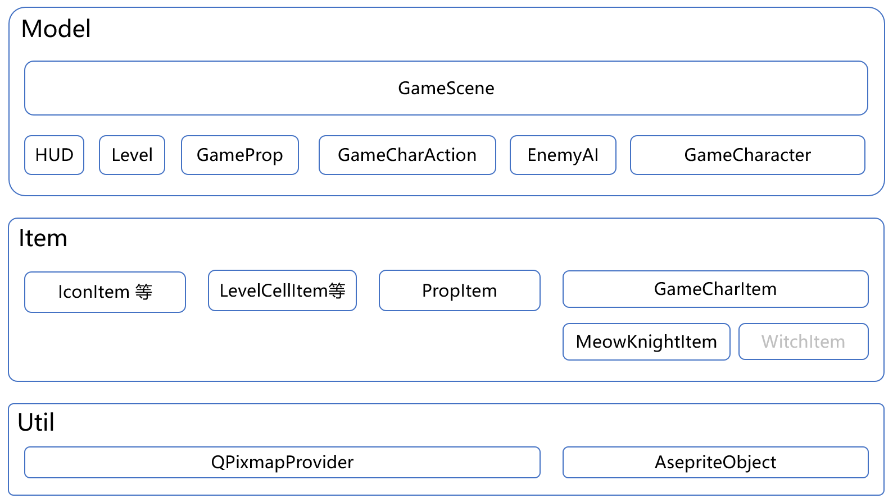

# 大作业文档

[toc]

## 游戏概览

这是一个可爱的指挥猫猫~~打架~~玩耍的小游戏。

游戏截图：

开始界面：

游戏教程：

HUD指示：

移动指示：

更多内容可在游戏中体验。

## 各个模块间逻辑关系

### 总览

其中，下层模块想上层模块提供服务。每个模块简要含义：

* `QGraphicsView`：这个是Qt自带的类，仅仅用来显示
* `Model`：对游戏内容建模，实现游戏逻辑、负责播放音效
* `Item`：其下类都继承自`QGraohicsItem`，提供可重用的图像绘制服务
* `UI`：其下类都继承自`QWidget`，实现带游戏素材背景的Panel对象
* `Util`：一些工具类
* `R`：管理全局资源

### 主要关系图

#### Util部分

##### QPixmapProvider

由于很多图片素材是多张图片拼接而成的，这个类的目的就是把一张大图片根据不同的方式进行切分，然后提供出去。这个类的子类有：

* QPixmapGirdSplitter：固定的通过网格切割，但有些素材的拼接时没有严格按照网格拼接。
* ~~QPixmapAutoSplitter~~：已弃用。自动根据像素间相近程度进行素材切割，但对粒子特效之类的素材效果极差，所以弃用。
* ~~QPixmapFileSeq~~：已弃用。有些动画素材是连续编号的文件组成的，这个类自动读取这一系列图片。但我没用这样的素材，于是弃用。

##### AsepriteObject

有一些动画素材是用`Aseprite`这个软件做的，这个软件可以导出一张大图和一个描述`json`，用来指明动画的每一帧是大图中的哪个区域，这个类能读取这两个文件，提供每一帧的图片、持续时间，动画方向等信息。

#### Item部分

