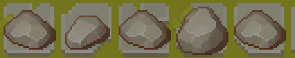

# 大作业文档

> 本次作业已经发布到了github: 
>
> https://github.com/GJCav/qt-summer


Table of Contents
=================

* [大作业文档](#大作业文档)
* [TOC](#toc)
  * [游戏概览](#游戏概览)
  * [各个模块间逻辑关系](#各个模块间逻辑关系)
    * [总览](#总览)
    * [主要关系图](#主要关系图)
      * [Util模块](#util模块)
        * [QPixmapProvider](#qpixmapprovider)
        * [AsepriteObject](#asepriteobject)
      * [Item模块](#item模块)
        * [GameCharItem](#gamecharitem)
        * [PropItem](#propitem)
        * [向Level提供服务的类](#向level提供服务的类)
        * [向HUD提供服务的类](#向hud提供服务的类)
    * [Model模块](#model模块)
      * [HUD](#hud)
      * [Level](#level)
      * [GameProp](#gameprop)
      * [GameCharacter](#gamecharacter)
      * [GameCharAction](#gamecharaction)
      * [EnemyAI](#enemyai)
      * [GameScene](#gamescene)
  * [程序运行流程](#程序运行流程)
  * [为什么使用Debug模式编译？](#为什么使用debug模式编译)
  * [参考](#参考)


## 游戏概览

这是一个可爱的指挥猫猫~~打架~~玩耍的小游戏。

### 界面交互

开始界面：


游戏教程：


HUD指示：


移动指示攻击指示类似：


失败提示：


### 地形设计

具有网格地图，具有地形：草地、围墙、石板。

* 草地：最普通的地形，没有任何特殊效果。

* 围墙：游戏场地周围的石墙，用来框定棋盘范围。

* 石板：具有减小角色移动速度的效果。~~毕竟众所周知，毛毛在石板上会打滑~~

除了基础地面，地形还包括地面上生成物，目前有如下生成物：

* 箱子、石块：阻碍角色移动

* 魔法石：给上下左右的角色回复生命值

* 花瓶：给上下左右的角色扣除生命值

  > 具体画面见下文详细说明


### 角色设计

属性设置：

* 生命值
* 攻击力
* 移动速度(机动性)
* 攻击范围
* 护甲：

有如下角色：

* 喵


## 各个模块间逻辑关系

### 总览


其中，下层模块想上层模块提供服务。每个模块简要含义：

* `QGraphicsView`：这个是Qt自带的类，仅仅用来显示
* `Model`：对游戏内容建模，实现游戏逻辑、负责播放音效
* `Item`：其下类都继承自`QGraohicsItem`，提供可重用的图像绘制服务
* `UI`：其下类都继承自`QWidget`，实现带游戏素材背景的Panel对象
* `Util`：一些工具类
* `R`：管理全局资源


### 主要关系图


#### Util模块

##### QPixmapProvider

由于很多图片素材是多张图片拼接而成的，这个类的目的就是把一张大图片根据不同的方式进行切分，然后提供出去。这个类的子类有：

* QPixmapGirdSplitter：固定的通过网格切割，但有些素材的拼接时没有严格按照网格拼接。
* ~~QPixmapAutoSplitter~~：已弃用。自动根据像素间相近程度进行素材切割，但对粒子特效之类的素材效果极差，所以弃用。
* ~~QPixmapFileSeq~~：已弃用。有些动画素材是连续编号的文件组成的，这个类自动读取这一系列图片。但我没用这样的素材，于是弃用。


##### AsepriteObject

有一些动画素材是用`Aseprite`这个软件做的，这个软件可以导出一张大图和一个描述`json`，用来指明动画的每一帧是大图中的哪个区域，这个类能读取这两个文件，提供每一帧的图片、持续时间，动画方向等信息。


#### Item模块

这个模块的所有对象继承自`QGrphicsItem`，部分继承了`QObject`以启用动画。

这个模块是对基本图片资源的使用，支持动画，实现了`Model`所需要的函数，向`Model`模块提供服务。但是改模块并不关心各个图片在游戏中应该出现的展示大小和坐标位置，使用图片素材本身的大小和屏幕坐标。

详细介绍如下：

##### GameCharItem

这个类是一个接口类，要求实现游戏角色所需的各种动画，包含如下接口/动画

* idle：待机
* moveTo：移动
* attack：攻击
* takeDamage：收到伤害
* healed：得到治疗
* death：死亡
* dodge：闪避
* setTowards：设置朝向


实现这些接口的有：

* MeowKnightItem：就是我们的猫猫骑士
* ~~WhichItem~~：计划但还没有实现的女巫角色，有了猫还能没有女巫？


##### PropItem

地面上的生成物类，向`GameProp`类提供服务，目前支持的有：

* 石头：
* 箱子：
* 治疗魔法石：


##### 向Level提供服务的类

有两个类向地形`Level`类提供服务：

* `LevelCellItem`：地形格子类，目前有如下两类格子：

  * 草地：最普通的地形。
  * 石板：使角色减速。

* `CellIndicatorItem`：单元格指示类，用来指明要选择的格子。

  


##### 向HUD提供服务的类

包含一个按钮`ButtonItem`和图标`IconItem`。效果如下：

         


除了这个还有其他一些UI模块的类。


### Model模块

这一模块的大部分类继承自`QObject`，使用下层模块提供的服务，进行“游戏棋盘坐标”和“绘图坐标”转换、音效播放等操作，向`GameScene`提供服务。

而`GameScene`继承自`QGraphicsScene`，表示游戏的一个“关卡”、“场景”，负责管理游戏中的所有逻辑。开始界面是一个特殊的`GameScene`。


#### HUD

“抬头显示”界面，展示状态和操作游戏。下图中的各个按钮都是`HUD`实现的：


#### Level

对游戏地形进行建模，虽然就是一个棋盘谈不上“地形”，但因为一开始想做成3D的，所以就把名字定为了`Level`，然后就失败了。

这个类维护了一个游戏棋盘，提供了一些设置棋盘的方便函数。


#### GameProp

简单包装`PropItem`，进行游戏坐标和绘图坐标的转换。


#### GameCharacter

游戏角色类，维护角色生命值、攻击力、速度等游戏信息，包含移动、攻击等角色行为\函数，提供角色支持的操作等信息。

维护角色信息如下：

* 角色名
* 角色：玩家或电脑
* 生命值
* 移速
* 防御力
* 攻击力
* 幸运值：越高越容易闪避攻击


实现行为如下：

* 攻击
* 受到攻击
* 受到治疗
* 移动到
* 死亡
* 闪避
* 设置朝向


提供操作信息，供HUD显示右侧操作按钮，支持如下：

* 移动操作
* 攻击操作


提供属性标签信息，供HUD显示上方小图标，支持如下：

* 是否是敌人，若是，有：
* 是否减速，若是，有：
* 是否死亡，若是，有：
* 是否具有防御力，若是，有：


#### GameCharAction

由`GameCharacter`创建供`GameScene`使用，委托其管理接受用户对角色的操作。

该类是抽闲类，包含如下接口：

* process：开始用户操作
* cancel：用户取消操作


提供函数非接口函数如下：

* endProcess，操作结束，改函数必须在操作正常结束后调用。

* setAllowCancel，设置是否允许ESC键取消操作。


属性如下：

* buttomIten：关联的按钮对象


#### EnemyAI

敌人AI类。`GameScene`将操作敌人委托给这个类。

这个类是抽象类，包含如下接口：

* start，AI开始敌人的行动，由`GameScene`调用

包含属性：

* game：拥有这个AI的游戏场景

信号：

* AITurnFinished，要求在AI结束所有操作后发射该信号。`GameSene`收到后开始下一轮。


实现`EnemyAI`的类：

* BaseAI：基本的靠近攻击逻辑。


#### GameScene

这个类派生自`QGraphicsScene`类，负责管理一个游戏关卡，其中开始界面视为一个特殊的关卡。

一个`GameScene`由一个HUD、一个Level、一系列GameProp、一系列GameCharacter、一个EnemyAI组成。实现了游戏中的所有逻辑。

为了提高`GameScene`重用性，`GameScene`有如下虚函数在提供默认行为的情况下可供重载：

* successOrFailed：该函数在玩家轮或AI轮结束后调用，判断玩家输赢或继续游戏。默认为所有玩家角色死亡失败，所有敌方角色死亡胜利，其余继续游戏。
* gameSuccess：判断游戏胜利后调用的函数。默认为弹出胜利提示窗，点击后回到开始界面。
* gameFailed：判断游戏失败后调用。默认为弹出失败提示窗，点击后回到开始界面。
* endTurnEvent：玩家点击“结束回合”后调用，默认行为为调用`successOrFailed`然后决定开始AI论或者结束游戏。
* beginAITurn：开始AI轮。重载后必须调用父类的这个函数。会维护一下状态信息。
* endAITurn：结束AI轮。同上。


* initLevel：初始化地形，默认初始化为全是草地，周围有围墙。
* initPropItems：初始化生成物。默认无生成。
* initChars：初始化角色，包括玩家角色和敌人。默认无任何角色。
* initHUD：初始化HUD。默认开启HUD。
* initAI：初始化AI。默认BaseAI
* initChore：杂项初始化。这个函数在初始化的最后调用，可以用来初始化游戏开始时的弹出窗口之类的。默认无任何行为。


  


## 程序运行流程

双击运行：

```flow
st=>start: 开始游戏
main=>operation: main函数
* 播放背景音乐
* 进入开始界面
scene=>operation: 流程托管到GameScene

st->main->scene
```


GameScene流程：

```flow
st=>start: 开始GameScene流程
init=>operation: 初始化，依次调用：
* initLevel
* initPropItems
* initChars
* initHUD
* initAI
* initChore
playerTurn=>operation: 进入玩家轮
playerAction=>operation: 委托GameCharAction管理玩家操作
plyActEnd=>condition: 玩家结束回合？
succOrFail=>condition: 玩家是否胜利？
success=>operation: 调用gameSuccess()
fail=>operation: 调用gameFailed()
aiTurn=>operation: AI轮
aiWin=>condition: AI是否胜利？

st->init
init->playerTurn
playerTurn->playerAction
playerAction->plyActEnd
plyActEnd(yes)->succOrFail
plyActEnd(no)->playerAction
succOrFail(no)->aiTurn
succOrFail(yes)->success
aiTurn->aiWin(yes)->fail
aiWin(no)->playerTurn
```


## 为什么使用Debug模式编译？

我使用的是Qt6.2版本，这是一个preview版本。其中虽然包括了multimedia模块，但里面还是有问题。其中的bug复现可用如下代码复现：

```c++
auto list = QMediaDevices::audioOutputs();
```

具体行为如下(下列所用编译器版本都为Qt6.2安装时对应版本)：

* 在MinGW下Debug和Release编译运行、调试都会报错。
* 在MSVC下，Release编译通过，但是会闪退；Debug模式下编译通过调试启动时闪退，但直接运行不会闪退，所以就只能发布Debug编译版本了。

> MinGW调试时会直接显示`audioOutputs`这个函数调用后崩溃。
>
> MSVC调试时错误信息会定位到`multimedia.dll`这个文件，定位到`QSample`这个类。


## 参考

书籍参考：

* Qt 5.9 C++ 开发指南
* Game Programming using Qt, Beginners Guide


图片素材：https://itch.io/game-assets

> 更详细的见asset下各个文件夹的README文件


音效素材：

* 背景音乐：Let's chuchu, 天空のグリニッジ, [風鈴ぼるけいの](orpheus://orpheus/pub/app.html#/m/artist/?id=11977033), [喫茶化猫でおしゃべりを](orpheus://orpheus/pub/app.html#/m/album/?id=34678954)
* 音效来源：https://www.aigei.com/

